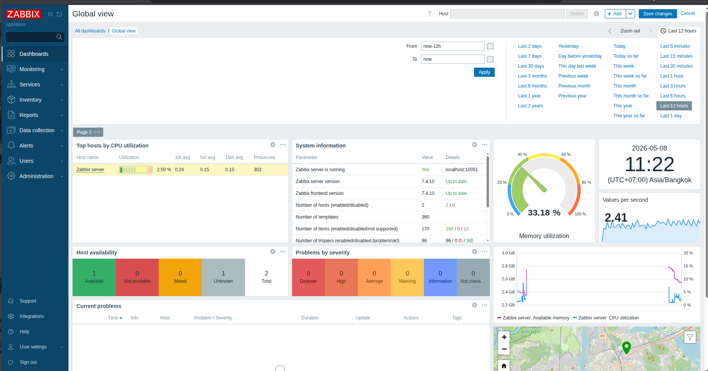
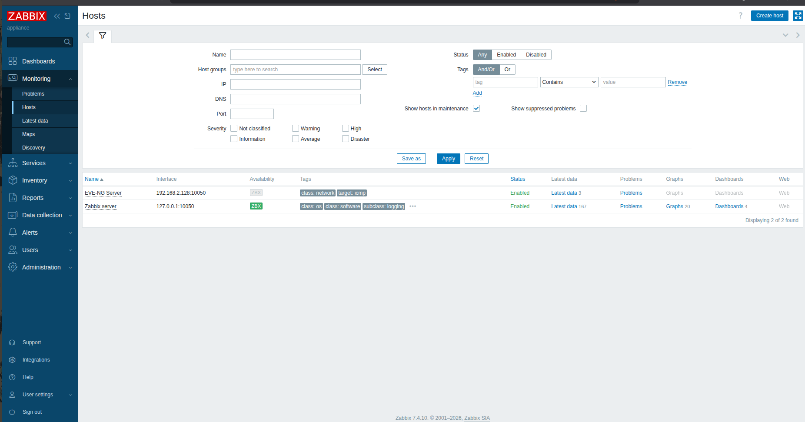
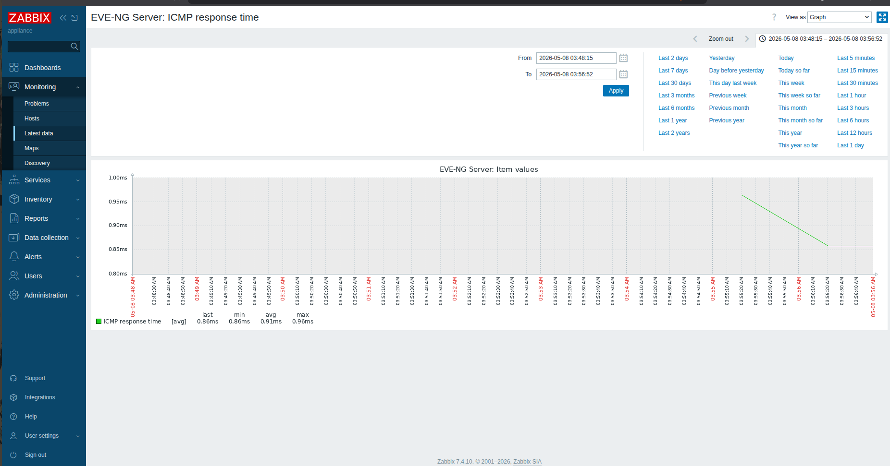

# Zabbix Network Monitoring Lab

## Overview
Deployed Zabbix 7.4 monitoring server on VMware Workstation 
to monitor network infrastructure availability and performance.

## Environment
- Zabbix 7.4.10 Appliance (Rocky Linux)
- EVE-NG network simulation environment
- VMware Workstation

## Monitored Hosts
| Host | IP | Template | Status |
|---|---|---|---|
| EVE-NG Server | 192.168.2.128 | ICMP Ping | Enabled |
| Zabbix Server | 127.0.0.1 | Linux by Zabbix Agent | Enabled |

## Monitored Metrics
- ICMP availability (Up/Down)
- Packet loss percentage  
- Response time (avg 0.86ms)
- CPU utilization
- Memory utilization

## Screenshots
### Global Dashboard

### Hosts List

### ICMP Response Time Graph

